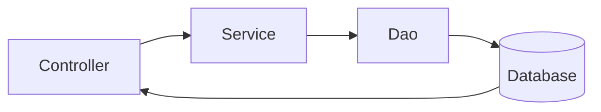

# 멘토링에서 배운 Spring 유지보수 기법(Legacy, Eclipse 기준)

멘토링으로 배운 것 중 유지보수 관점으로 묶을 수 있는 것을 정리하였습니다. 여전히 부족한 점이 많으니 참고하여 읽어주시면 감사하겠습니다.

---

<br>

## <span style="color:#802548">_1. Spring의 3-tier방식_</span>

<br>

- 스프링은 controller, dao, service가 서로 맞물리는 구조입니다.

  - Controller는 Presentation-tier(화면), Service는 Business-tier(로직), Dao는 Persistence-tier(데이터)입니다.

  * 데이터를 받아오고(Dao), 데이터를 처리할 방식을 만들고(Service), 데이터를 화면에 연결(Controller)시킵니다.

  - 3계층으로 구분시킨 이유는 각 영역을 독립시켜 유지보수에 용이하게 하기 위해서입니다.



<br>

그러한 관점에서 아래 코드는 controller에 business logic이 들어가 있고 dao도 호출하고 있기에, 적절하지 못한 소스코드 입니다.  
Business logic은 Service 계층으로 넣고, Dao 또한 <span style="color:#506F90">Service 계층</span>에서 호출되는 구조로 변경되어야 합니다.

```java
@RestController
@PostMapping("/api/boards/insert")
public void insert(@Valid BoardDTO insertDto, MultipartHttpServletRequest multi)
		throws IllegalStateException, IOException {
	MultipartFile file = multi.getFile("file");
	String contentType = file.getContentType();

	if (!contentType.contains("image/jpeg") && !contentType.contains("image/png")) {
		throw new Error("이미지타입이 잘못되었습니다");
	}

	String osName = System.getProperty("os.name").toLowerCase();
	if (osName.contains("win")) {

		String path = "c:/upload/";
		File newFile = new File(path + file.getOriginalFilename());
		if (!newFile.exists()) {
			file.transferTo(newFile);
		}

	} else if (osName.contains("nix") || osName.contains("nux") || osName.contains("aix")) {

			String path= "/usr/local/apache-tomcat-8.5.85/webapps/upload";
			File newFile= new File(path + file.getOriginalFilename());
			if (!newFile.exists()){
				file.transferTo(newFile);
			}
	}

	insertDto.setBoardPhoto(file.getOriginalFilename());
	boardDao.insert(insertDto);
}
```

<br>

3-tier 요구사항을 반영하여 아래와 같이 변화를 줄 수 있습니다.  
Business-tier에 해당하는 Service class를 만들고 거기에 logic을 만듭니다. Service class에서 필요한 경우 Dao를 호출합니다.  
저는 boardDao.insert(insertDto);로 게시물 등록 쿼리문을 호출했습니다.

```java
@Service
public void insert(@Valid BoardDTO insertDto, MultipartHttpServletRequest multi)
		throws IllegalStateException, IOException {
	MultipartFile file = multi.getFile("file");
	String contentType = file.getContentType();
	if (!contentType.contains("image/jpeg") && !contentType.contains("image/png")) {
		throw new Error("이미지타입이 잘못되었습니다");
	}
	String osName = System.getProperty("os.name").toLowerCase();
	if (osName.contains("win")) {

		String path = "c:/upload/";
		File newFile = new File(path + file.getOriginalFilename());
		if (!newFile.exists()) {
			file.transferTo(newFile);
		}

	} else if (osName.contains("nix") || osName.contains("nux") || osName.contains("aix")) {

		String path= "/usr/local/apache-tomcat-8.5.85/webapps/upload";
		File newFile= new File(path + file.getOriginalFilename());
		if (!newFile.exists()){
			file.transferTo(newFile);
		}
	}

	insertDto.setBoardPhoto(file.getOriginalFilename());
	boardDao.insert(insertDto);
}
```

<br>
그리고 서비스를 Presentation-tier에 해당하는 Controller class에서 호출합니다.

```java
@RestController
@PostMapping("/api/boards/insert")
	public ResponseEntity<String> insert(@Valid BoardDto insertDto, MultipartHttpServletRequest multi) throws ServiceException {

		boardService.insertBoardInfo(insertDto, multi);

		return  new ResponseEntity<String>(HttpStatus.OK);
	}
```

---

<br>

## <span style="color:#802548">_2. properties 파일을 활용해 하드 코딩 덜어내기_</span>

<br>

- 하드코딩이란 값을 직접 소스코드에 기입하여 사용하는 방식을 의미합니다.

  - 하드 코딩을 하게 되면 일일이 찾아야 해 관리가 어려워지게 됩니다.
  - 따라서 하드 코딩을 최대한 자제하고 별도의 설정파일 안에서 관리될 수 있게 하는 편이 유지보수에 좋습니다.

  <br>

1번의 예제를 이어서 살펴보도록 하겠습니다.  
아래의 Service class를 살펴보면 path가 하드코딩된 모습을 볼 수 있습니다.

```java
@Service
public void insert(@Valid BoardDTO insertDto, MultipartHttpServletRequest multi)
		throws IllegalStateException, IOException {
	MultipartFile file = multi.getFile("file");
	String contentType = file.getContentType();
	if (!contentType.contains("image/jpeg") && !contentType.contains("image/png")) {
		throw new Error("이미지타입이 잘못되었습니다");
	}
	String osName = System.getProperty("os.name").toLowerCase();
	if (osName.contains("win")) {

		String path = "c:/upload/";
		File newFile = new File(path + file.getOriginalFilename());
		if (!newFile.exists()) {
			file.transferTo(newFile);
		}

	} else if (osName.contains("nix") || osName.contains("nux") || osName.contains("aix")) {

		String path= "/usr/local/apache-tomcat-8.5.85/webapps/upload";
		File newFile= new File(path + file.getOriginalFilename());
		if (!newFile.exists()){
			file.transferTo(newFile);
		}
	}

	insertDto.setBoardPhoto(file.getOriginalFilename());
	boardDao.insert(insertDto);
}
```

<br>

우선 path부터 바꿔보도록 하겠습니다. String path를 별도의 설정파일에서 받아오려면 properties파일이 필요합니다.  
하지만 Legacy는 boot와는 다르게 properties파일을 읽어오는 설정을 직접 구현해야 합니다.

```java
@Configuration
public class PropertyConfig {

	@Bean
	public PropertyPlaceholderConfigurer propertyConfigurer() {
		PropertyPlaceholderConfigurer propertyConfigurer=new PropertyPlaceholderConfigurer();

		ClassPathResource classpathResource=new ClassPathResource("local.properties");
		propertyConfigurer.setLocation(classpathResource);
		return propertyConfigurer;
	}
}
```

<br>

Properties 파일을 읽는 configuration을 만들었다면, web.xml에서 읽어와야 합니다.  
 web.xml을 java 소스코드로 변형한 class의 경우, 아래와 같이 사용할 수 있습니다.  
ApplicationContext가 configuration을 읽게끔 설정하는 작업입니다. 여기에 아래와 같이 <span style="color:#506F90">PropertyConfig</span>를 등록합니다.

```java
public class MyWebAppInitializer implements WebApplicationInitializer {

	@Override
	public void onStartup(ServletContext servletContext) throws ServletException {
		 AnnotationConfigWebApplicationContext context = new AnnotationConfigWebApplicationContext();
		  context.setConfigLocations("com.example.configuration.WebServletConfig","com.example.configuration.RootConfig","com.example.configuration.PropertyConfig"...);
.
.
.
	}
}
```

<br>
그럼 이제 properties파일을 사용할 수 있습니다. 아래는 local.properties의 내용입니다.

```java
path=/upload/
origin=http://localhost:3000
```

<br>

이제는 local.properties파일에서만 값을 바꾸면 다른 클래스에서 일일이 찾아가며 바꾸지 않게끔 작업할 차례입니다.  
properties파일의 값은 @Value를 통해 가져올 수 있습니다. 가져올 value의 key를 ${}안에 넣어주면 됩니다.

```java
@Service
public void insert(@Valid BoardDTO insertDto, MultipartHttpServletRequest multi)
		throws IllegalStateException, IOException {

	@value("${path}")
	String path;

	MultipartFile file = multi.getFile("file");
	String contentType = file.getContentType();
	if (!contentType.contains("image/jpeg") && !contentType.contains("image/png")) {
		throw new Error("이미지타입이 잘못되었습니다");
	}
	String osName = System.getProperty("os.name").toLowerCase();
	if (osName.contains("win")) {

		File newFile = new File(path + file.getOriginalFilename());
		if (!newFile.exists()) {
			file.transferTo(newFile);
		}

	} else if (osName.contains("nix") || osName.contains("nux") || osName.contains("aix")) {

		File newFile= new File(path + file.getOriginalFilename());
		if (!newFile.exists()){
			file.transferTo(newFile);
		}
	}

	insertDto.setBoardPhoto(file.getOriginalFilename());
	boardDao.insert(insertDto);
}
```

---

<br>

## <span style="color:#802548">_3. spring.profiles.active를 통해 local과 dev 분기처리_</span>

<br>

- 분기처리란 조건에 따라 다르게 값을 설정하는 행위를 의미합니다.

  - 설정이 다르기에 필요한 환경, 시스템 변수값이 다릅니다.
  - local과 linux서버의 차이로 매번 바꿔가는 커밋을 하면 불필요한 commit이 많아져 commit history 관리가 어려워집니다.
  - 따라서 local과 dev는 분기처리가 필요합니다.

<br>

위에서는 linux일 때의 path를 설정하지 않았기에 배포서버에서 이미지 등록 시 경로를 찾지 못하는 오류가 발생하게 됩니다.  
다행히 <span style="color:#506F90">Spring.active.profiles</span>를 통해 해당 문제를 해결할 수 있습니다.  
2번예제 PropertyConfig class를 이어서 살펴보도록 하겠습니다.

<br>

2번과는 다르게 이번에는 String profile=System.getProperty("spring.profiles.active");라는 소스코드가 추가되었습니다.  
System.getProperty()를 통해 vm argument의 값을 얻어올 수 있습니다.  
그를 통해 local 모드라면 local.properties에서 값을 가져오게 하고, dev 모드라면 dev.properties에서 값을 가져오게 하면 됩니다.

```java
@Configuration
public class PropertyConfig {

	@Bean
	public PropertyPlaceholderConfigurer propertyConfigurer() {
		PropertyPlaceholderConfigurer propertyConfigurer=new PropertyPlaceholderConfigurer();

		String profile=System.getProperty("spring.profiles.active");
		ClassPathResource classpathResource=new ClassPathResource(profile+".properties");
		propertyConfigurer.setLocation(classpathResource);
		return propertyConfigurer;
	}
}
```

window(local) eclipse에서는 아래와 같이 vm argument를 설정할 수 있습니다.

<br>

Servers Overview ㅡ> Open launch configuration ㅡ> Arguments ㅡ>-Dwtp.deploy=와 -add사이에 -Dspring.profiles.active=local 추가

```java
 -Dwtp.deploy="C:\data\spring\.metadata\.plugins\org.eclipse.wst.server.core\tmp0\wtpwebapps" -Dspring.profiles.active=local --add-opens=java.base/java.lang=ALL-UNNAMED --add-opens=java.base/java.io=ALL-UNNAMED --add-opens=java.base/java.util=ALL-UNNAMED --add-opens=java.base/java.util.concurrent=ALL-UNNAMED --add-opens=java.rmi/sun.rmi.transport=ALL-UNNAMED
```

<br>

linux 서버(dev)에서는 tomcat directory의 bin폴더에 setenv파일을 만들어 설정합니다.

```bash
JAVA_OPTS="$JAVA_OPTS -Dspring.profiles.active=dev"
```

<br>

dev.properties파일은 서버에 맞게 설정합니다.

```java
path=/usr/local/apache-tomcat-8.5.85/webapps/upload/
origin=http://dpms.openobject.net:11111111111
```

<br>

이제 Service class에서 더이상 소스코드로 window와 linux 분기를 만들 필요가 없습니다.  
따라서 아래와 같이 소스코드 양이 줄어듭니다.

```java
@Service
public void insert(@Valid BoardDTO insertDto, MultipartHttpServletRequest multi)
		throws IllegalStateException, IOException {

	@Value("${path}")
	private String path;

	MultipartFile file = multi.getFile("file");

	String contentType = file.getContentType();

	if (!contentType.contains("image/jpeg") && !contentType.contains("image/png")) {
		throw new Error("이미지파일만 가능합니다.");
	}

	File newFile = new File(path + file.getOriginalFilename());
	if (!newFile.exists()) {
		try {
			file.transferTo(newFile);
		} catch (Exception e) {
			log.info("{}", e.getMessage());
		}
	}

	insertDto.setBoardPhoto(file.getOriginalFilename());
	boardMapper.insert(insertDto);
}
```

---

<br>

## <span style="color:#802548">_4.@ControllerAdvice를 활용해 Exception을 전역처리_</span>

<br>

- @ControllerAdvice는 Exception을 전역으로 관리하게 해주는 Spring의 기능입니다.

  - Enum을 통해 Exception message를 하나의 파일안에서 관리하면 유지보수하기에 매우 간편할 것입니다.
  - @ControllerAdvice를 이용해 Exception class 또한 모아놓고 하나의 파일에서 관리할 수 있습니다.

<br>

3번 예제에 이어서 살펴보도록 하겠습니다. 우선 Exception message부터 하나의 파일로 모아보겠습니다.  
앞으로는 아래의 enum에서 오류메시지를 관리하게 됩니다. 개별 오류 메시지들을 알기 위해 모든 Service class를 훑어볼 필요가 없습니다.

```java
@Getter
@RequiredArgsConstructor
public enum CommonErrorCode {
	//Board
	BOARD_BAD_TYPE("이미지파일만 가능합니다.")

	private final String message;
}
```

<br>

그 다음으로 Exception class를 만들어보겠습니다.  
Service에 필요한 Exception을 던지는 class라서 ServiceException이라고 이름지었습니다.  
이제 ServiceException은 new로 생성될 때 반드시 String class type의 argument를 받아야 합니다.

```java
@Getter
@RequiredArgsConstructor
public class ServiceException extends RuntimeException{

	/**
	 *
	 */
	private static final long serialVersionUID = 1L;

	private final String errorResponse;

}
```

<br>

3번 예제의 Service class와 다르게 Error가 아니라 직접 구현한 ServiceException을 던지게 바뀌었습니다.  
메시지도 하드코딩된 메시지가 아니라 BOARD_BAD_TYPE.getMessage()와 같이 enum의 String 값을 받아오게 바뀌었습니다.

```java
@Service
public void insert(@Valid BoardDTO insertDto, MultipartHttpServletRequest multi)
		throws IllegalStateException, IOException {

	@Value("${path}")
	private String path;

	MultipartFile file = multi.getFile("file");

	String contentType = file.getContentType();

	if (!contentType.contains("image/jpeg") && !contentType.contains("image/png")) {
		throw new ServiceException(BOARD_BAD_TYPE.getMessage());
	}

	File newFile = new File(path + file.getOriginalFilename());
	if (!newFile.exists()) {
		try {
			file.transferTo(newFile);
		} catch (Exception e) {
			log.info("{}", e.getMessage());
		}
	}

	insertDto.setBoardPhoto(file.getOriginalFilename());
	boardMapper.insert(insertDto);
}
```

<br>

그 다음으로는 전역으로 관리하기 위해 <span style="color:#506F90">@ControllerAdvice</span>를 만듭니다.  
@ControllerAdvice를 달면 스프링 컨테이너에서 관리하는 대상(Component)이 됩니다.  
@Rest가 달린 이유는 front framework를 쓰게되면 json으로 보내야 하기 때문입니다.  
annotation이 RestController인 것만 대상으로 ServiceException을 잡아내게 됩니다.

```java
@RestControllerAdvice(annotations = RestController.class)
public class ServiceExceptionAdvice{


    @ExceptionHandler(ServiceException.class)
    @ResponseStatus(HttpStatus.INTERNAL_SERVER_ERROR)
    public ExceptionDto serviceException(HttpServletRequest request,ServiceException serviceException) {
    	 ExceptionDto exceptionDto=new ExceptionDto();
    	 exceptionDto.setRequestURL(request.getRequestURI());
    	 exceptionDto.setMessage(serviceException.getErrorResponse());
        return exceptionDto;
    }
}
```

<br>

간단하게 ExceptionDto를 만들었습니다.  
error 메시지를 어떻게 가공하여 프론트에 전송할할 것인가에 따라 더 많은 field가 필요할 수도 있습니다.

```java
@Data
public class ExceptionDto {
	private  String requestURL;
	private  String message;
}
```

<br>

boot와 달리 자동으로 ComponentScan이 되지 않기 때문에 ComponentScan 대상임을 명시해주어야 합니다.  
아래와 같이 WebServletConfig에 달아주었습니다.

```java
@ComponentScan(basePackages = { "com.example.controller","com.example.exception" })
public class WebServletConfig implements WebMvcConfigurer {
	.
	.
}
```

---

<br>

## <span style="color:#802548">_5. 전역 Cors 허용 설정_</span>

<br>

- cors는 리소스가 자신의 출처(도메인, 프로토콜, 포트)와 다를 때 교차 출처 HTTP 요청을 실행합니다.

  - 기본적으로 브라우저는 교차출처 HTTP 요청을 제한합니다.
  - 즉, 프론트 프레임워크를 따로 사용하게 되면 호스트가 바뀌게 되면서 서로 다른 출처로 인식되어 cors 오류가 납니다.
  - 따라서 front 프레임워크를 사용하는 경우, 서버의 cors 설정에서 교차 출처를 허용해야 합니다.

<br>

먼저 @CrossOrigin을 사용할 수 있습니다.  
다만 아래와 같이 모든 Controller class마다 달아주게 되면 cors가 바뀌면 매번 전부 다시 쳐서 바꿔주어야 합니다.

```java
@CrossOrigin(origins="http://dpms.openobject.net:1111111111")
@RestController
public class BoardController {
	.
	.
	.
}
```

<br>

따라서 annotation이 아닌 소스코드로 바꾸고, 전역으로 설정가능한 방식으로 변경합니다.  
우선은 WebServletConfig에서 전역 설정이 가능합니다.

```java
@Configuration
public class WebServletConfig implements WebMvcConfigurer {

    @Override
    public void addCorsMappings(final CorsRegistry registry) {
        registry.addMapping("/**")
                .allowedOrigins("http://localhost:3000")
                .allowedMethods("GET", "POST")
                .maxAge(3000);
    }
}
```

<br>

여기서도 local.properties 파일을 활용해보겠습니다. 기억이 나지 않을 수 있으니 다시 가져왔습니다.

```java
path=/upload/
origin=http://localhost:3000
```

<br>

@Value를 활용해 WebServletConfig를 아래와 같이 변경할 수도 있습니다.

```java
@Configuration
public class WebServletConfig implements WebMvcConfigurer {

	@Value("${origin}")
	String origin;

    @Override
    public void addCorsMappings(final CorsRegistry registry) {
        registry.addMapping("/**")
                .allowedOrigins(origin)
                .allowedMethods("GET", "POST")
                .maxAge(3000);
    }
}
```

<br>

또는 <span style="color:#506F90">Spring Security와 Filter</span>를 활용할 수도 있습니다. 우선 CorsFilter를 만들어줍니다.  
CorsFilter는 아래와 같이 CorsConfig에서 bean으로 등록합니다.  
bean이 되면 Spring Container의 관리 대상이 되기 때문에 DI가 가능해집니다.

```java
@Configuration
@Slf4j
public class CorsConfig {

	@Value("${origin}")
	private String origin;

	@Bean
	public CorsFilter corsFilter()	{
		CorsConfiguration config=new CorsConfiguration();
		config.setAllowCredentials(true);
		config.addAllowedOrigin(origin);
		config.addAllowedHeader("*");
		config.addAllowedMethod("*");
		source.registerCorsConfiguration("/api/**", config);
		return new CorsFilter(source);
	}

}
```

<br>

CorsFilter를 만들고 bean으로 등록시켰으므로 이제 DI를 해줄 수 있습니다.  
이제부터 SecurityConfig는 CorsFilter를 주입받아 CorsFilter에 서술된 origin(localhost:3000) 사이트는 cors를 허용해주게 됩니다.

```java

@Configuration
@RequiredArgsConstructor
@EnableWebSecurity
@ComponentScan(basePackages = { "com.example.authentication" })
public class SecurityConfig extends WebSecurityConfigurerAdapter {

	private final CorsFilter corsFilter;
.
.
.
	@Override
	protected void configure(HttpSecurity http) throws Exception {
		http.csrf().disable()
		.
		.
		.
				.addFilter(corsFilter)
.
.
.
	}

}
```

<br>

---

## <span style="color:#802548">_6. encoding 전역 설정하기_</span>

<br>

- content-type은 자원의 형식을 명시하기 위해 헤더에 실리는 정보입니다.

  - content-type에서 charset을 잘못 설정하면 한글의 경우 인코딩이 깨져서 가는 경우가 종종 발생합니다.
  - 따라서 한글이 깨지는 경우, encoding 방식을 바꿔야합니다.

<br>

이번에는 게시물 등록(insert)이 아니라 게시물 목록 조회(list)로 가져왔습니다.  
content-type을 명시하기 위해 아래와 같이 header를 넣을 수 있습니다.

```java
@GetMapping("/api/boards")
public ResponseEntity<String> fetchList(int page, String searchType, String keyword, HttpServletResponse response)
		throws JsonProcessingException {
	BoardListResponse boardListResponse = new BoardListResponse();
	HttpHeaders header = new HttpHeaders();
	header.add("content-type", "application/json; charset=utf-8");

	boardListResponse.setBoardList(boardService.getList(page, searchType, keyword));
	boardListResponse.setBoardListTotal(boardService.getLast(searchType, keyword));

	return new ResponseEntity<String>(new ObjectMapper().writeValueAsString(boardListResponse), header, HttpStatus.OK);
}
```

<br>

또는 아래와 같이 header 설정 대신 produces를 활용할 수도 있습니다.  
produces도 본질적으로 header를 설정하는 것이지만 약간 더 소스코드가 짧아집니다.  
하지만 두 가지 모두 각 method마다 전부 동일하게 적어줘야 한다는 단점이 있습니다.

```java
@GetMapping(value = "/api/boards", produces = "application/json;charset=utf-8")
public ResponseEntity<String> fetchList(int page, String searchType, String keyword, HttpServletResponse response)
		throws JsonProcessingException {
	BoardListResponse boardListResponse = new BoardListResponse();

	boardListResponse.setBoardList(boardService.getList(page, searchType, keyword));
	boardListResponse.setBoardListTotal(boardService.getLast(searchType, keyword));

	return new ResponseEntity<String>(new ObjectMapper().writeValueAsString(boardListResponse), header, HttpStatus.OK);
}
```

<br>

따라서 아래와 같이 <span style="color:#506F90">messageConverter</span>를 활용한다면 한 곳에서 전역의 encoding을 관리할 수 있습니다.

```java
@ComponentScan(basePackages = { "com.example.controller","com.example.exception" })
public class WebServletConfig implements WebMvcConfigurer {
.
.
.
@Override
	 public void configureMessageConverters(List<HttpMessageConverter<?>> converters) {
	  StringHttpMessageConverter stringConverter = new StringHttpMessageConverter();
	  stringConverter.setSupportedMediaTypes(Arrays.asList(new MediaType("application", "json", Charset.forName("UTF-8"))));
	  converters.add(stringConverter);
	 }
}
```

<br>

또는 build 단계에서 encoding을 utf-8로 설정하는 것도 방법입니다. 경우에 따라서는 두 방법 모두 동원해야 할 수도 있습니다.

```java
	<properties>
	<project.build.sourceEncoding>utf-8</project.build.sourceEncoding>
		<java-version>1.8</java-version>
		.
		.
		.
	</properties>
```

---

<br>

여태까지 배우고 학습한 유지보수 기법을 예제를 통해 정리해보았습니다. 읽어주셔서 감사합니다.  
다들 남은 한 해 건승하시고 행복하시길 소망합니다.
