# JMeter 사용법

## JMeter란 ? 
Apache JMeter는 서버가 제공하는 성능 및 부하를 측정할 수 있는 테스트 도구입니다.   

JMeter는 자바로만 만들어진 오픈소스 어플리케이션이며,  
서버나 네트워크 등에 과부하를 주어 다양한 유형의 강도/부하 테스트로  
전체적인 성능에  대한 분석을 할 수 있습니다.

## JMeter의 특징
1. 다양한 프로토콜/서버 들을 테스트 가능
    - Http/Https 등 웹
    - Rest 서비스
    - JDBC를 이용한 데이터베이스
    - ...  
2. CLI를 지원
    - CI/CD 구성 시 원홯
    - 저 비용의 메모리 사용
3. 시나리오 기반 테스트 가능
4. 다양한 외부 플러그인 확장기능 제공

## JMeter의 기본 구성
1. Therad Group
    - 동시에 요청을 보낼 쓰레드 들의 그룹  
    - 쓰레드를 유저라고 생각했을때 몇명의 유저가 얼마만큼의 시간동안 몇 회 정도 진행할 것인지

2. Sampler
    - 유저(쓰레드)에게 어떤 행동을(API/URL)을 요청하도록 할 것인지

3. Listener
    - 결과 값(Sampler 의 반환 값)을 받고 어떤 행동을 할 것인지
    - 검증, 통계, UI 생성 등
    - CallBack 개념

4. Congfig Element(Configuration)
    - Sampler 또는 Listener를 사용할 때 필요한 설정 값
    - 쿠키, JDBC 커넥션 등

5. Assertion
    - 응답 결과의 성공 여부를 판단하는 조건 (응답 코드, 본문 내용 등)
    - 기본적인 응답 성공(Http Status Code 200) 외에 추가적인 조건으로 검증하고 싶은 경우 해당 방식 사용

## JMeter 설치
1. https://jmeter.apache.org/download_jmeter.cgi 에서 설치 파일을 다운로드 받은 후 압축 해제!
    - Mac의 경우 HomeBrew 가 설치되어 있다면 brew install jmeter 를 사용하여 설치 가능
2. https://jmeter-plugins.org/install/Install/ 에서 받은 .jar 파일을 plugin manager를 jmeter 설치 경로 안의 /lib/ext 안에 넣기!
    - Mac의 경우 설치 할 때 --with --plugins 를 추가하여 사용하면 같이 받을 수 있다고 했으나  
    아래와 같은 문제가 발생하여 .jar 파일로 추가했습니다
        >Error: No formulae or casks found for —-with-plugins
3. Encoding 변경
    - JMeter 설치폴더/bin -> jmeter.property 에서 UTF-8 인코딩 설정 주석 해제
        > The encoding to be used if none is provided (default UTF-8 since JMeter 5.6.1)  
        sampleresult.default.encoding=UTF-8
4. Plugin 추가
    - Options -> Available Plugins -> 필요한 플러그인 다운로드 및 적용

 
 
 
 

## JMeter 시작하기

<!-- 첫 설정 -->
JMeter 를 처음 실행했을 떄 Test Plan 이라는 신규 프로젝트가 생성됩니다
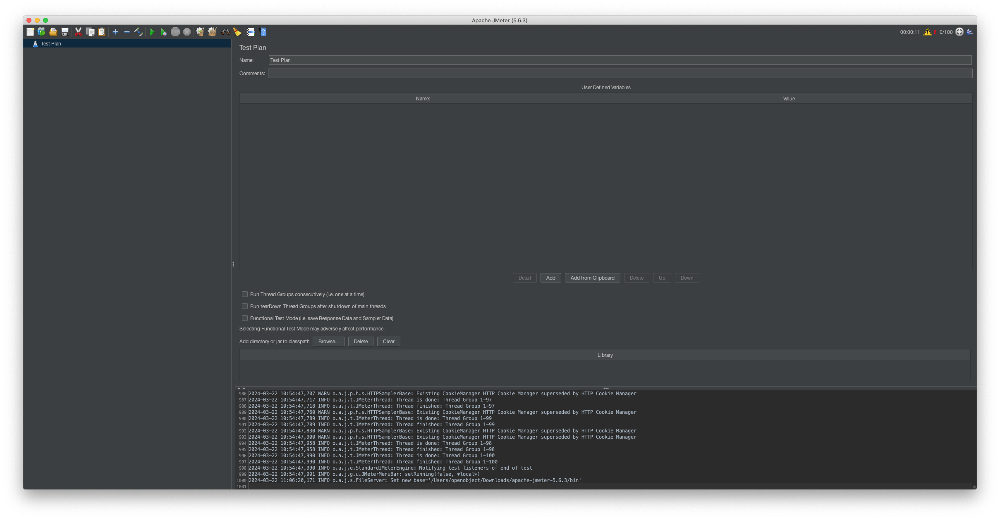

Test Plan을 우클릭 하여 Add -> Thread(Users) -> Thread Group을 클릭하여  
[Thread Group](#jmeter의-기본-구성)을 생성합니다
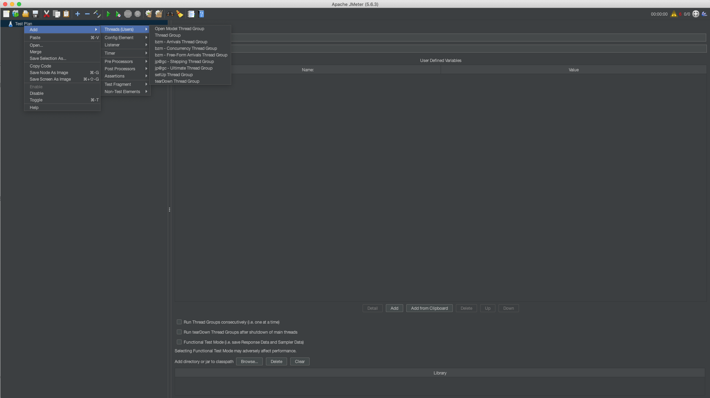

 
 

그룹을 생성한 후 어떤 동작을 실행하게 하도록 할건지 [Thread Group](#jmeter의-기본-구성) 설정을 해줍니다
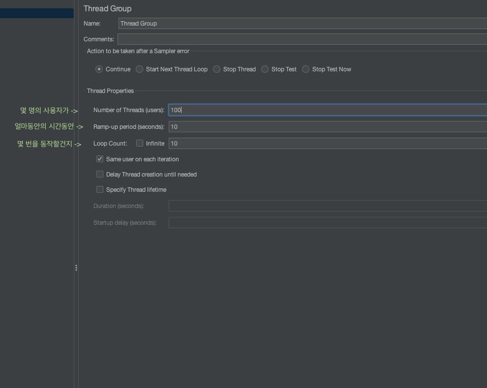

Thread Group을 생성하고 설정 했다면  
해당 그룹의 행동 지정을 위해 [Sampler](#jmeter의-기본-구성)를 생성해줍니다
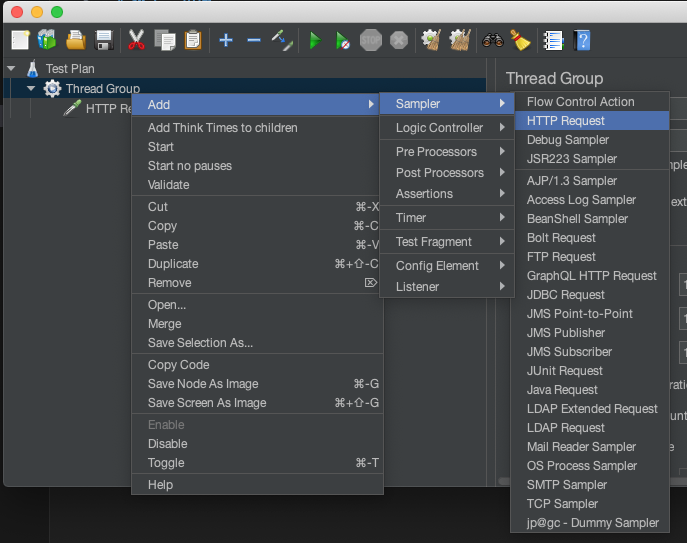

전역으로 값을 지정해주고 싶을경우 Test Plan에  
지정한 그룹만을 위한 설정 값이라면? Thread Group에 추가합니다  
하위 모든 케이스에 적용됩니다

[Sampler](#jmeter의-기본-구성)는 Http Request로 설정했습니다  
하단의 Add 버튼을 눌러 파라미터를 추가해 줄 수 있습니다  
맨 오른쪽의 Include Equals를 눌러 Name=? 형식의 쿼리파람을 같이 보낼 수 있습니다

Thread Group이 동작을 실행 할 때 사용할 값을 설정을 위해 [Config Element](#jmeter의-기본-구성)를 생성해줍니다

테스트에 사용될 요청값으로 쿠키를 사용하겠습니다

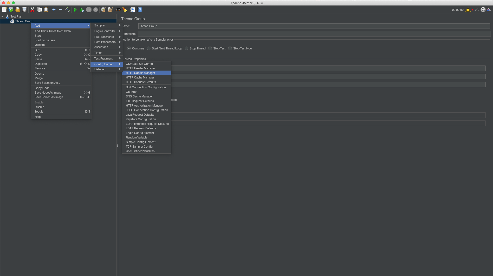

생성하게 되었다면 하기의 ADD 버튼을 눌러 정의 된 쿠키의 값을 넣어줍니다

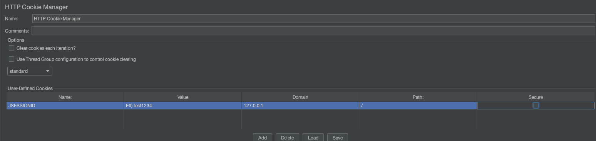

## 다양한 [Listener](#jmeter의-기본-구성)를 이용한 결과 값 표출

### [결과값들을 테이블 형식의 데이터로 정리된 값으로 표시]
이제 설정이후 결과 값 확인을 위한 Listener를 생성해줍니다
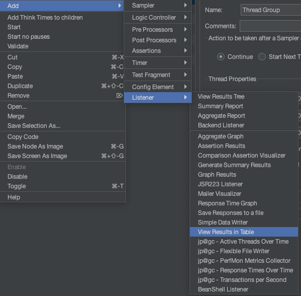

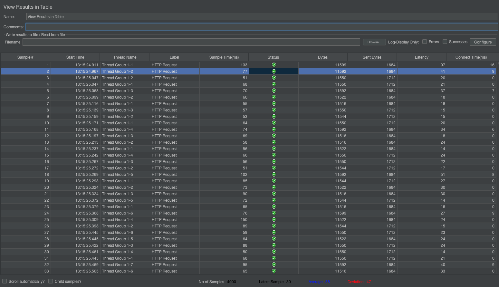
요청한 값이 잘 전달되고 잘 돌려받았는지 테이블 형식으로 정리해서 표시해줍니다

### [상세 정보를 보고싶다면]
Listener에서 최상단에 존재하는 View Result Tree를 같이 생성해주면 됩니다

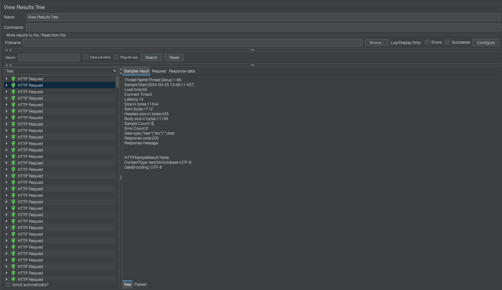
View Result Tree 에서는 각 요청별로의 결과값과 Request Body/Header 및 Response Body/Header또한 확인 할 수 있습니다.

### [결과값에 대한 통계를 원할경우]

Summary Report 리스터를 생성해줍니다

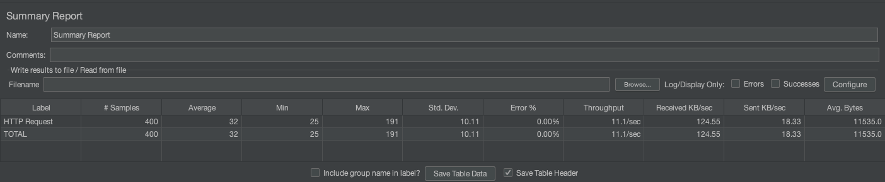

Summary Report는 요청한 결과값을 요약하여 정리해준다
- Label - 사용했던 request의 이름으로 분리 해줍니다 
     > 각 리퀘스트를 별개로 집계하고 싶다면 Http Request 별 이름을 꼭 다르게 저장해야합니다
- Samples - requset 갯수
- Average - Sample 소요시간의 평균
- Min - Sample 소요시간의 최소
- Max - Sample 소요시간의 최대
- Std. Dev. - Sample 소요시간의 표준편차
- Error % - 에러율
- Throughput - 시간당 처리량
- Received KB/sec - 시간당(sec) 받은 데이터(KB)
- Sent KB/sec - 시간당(sec) 보낸 데이터(KB)
- Avg. Bytes - 평균 바이트

하단의 Save Table Data버튼을 클릭하면 .csv 파일로 Export 해줍니다

### 통신상태에 대한 그래프를  보기위한 경우 Transaction Per Second 리스너를 생성해줍니다

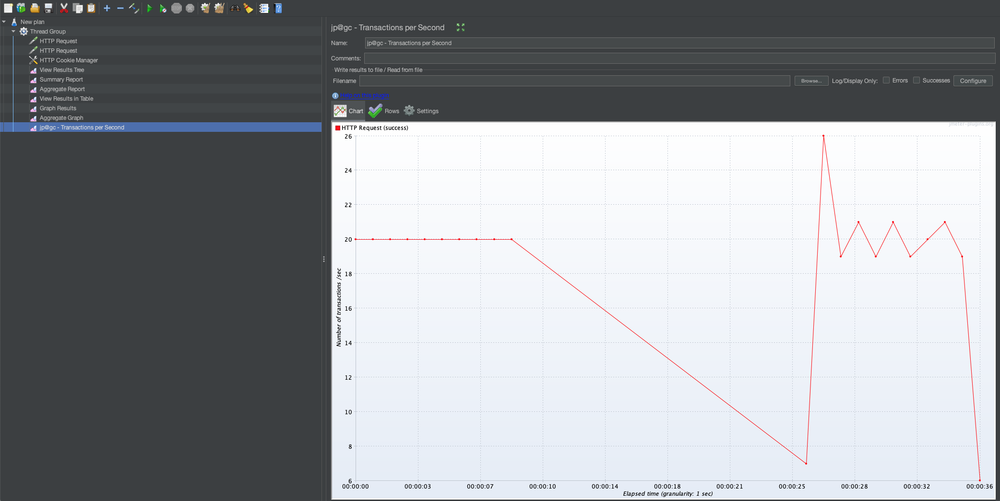

통신이 정상적으로 이루어졌는지 표시해줍니다

## 간단하게 시나리오를 생성하여 테스트 하는방법

Chrome 사용 시 Blaze Meter 라는 크롬 확장 프로그램을 사용하여 행동을 녹화하여 시나리오를 구성하는 간단한 방법이 있어  
간단하게 JMeter 시나리오 설정하는 방법을 알아보겠습니다

먼저 Chrome에 
<a href="https://chromewebstore.google.com/detail/blazemeter-the-continuous/mbopgmdnpcbohhpnfglgohlbhfongabi" target="_blank">Blaze Meter</a>
를 추가해줍니다

설치 이후 확장 프로그램을 클릭합니다

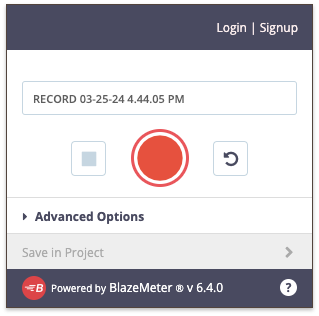

확장 프로그램을 열게 되면 해당 화면이 열리게 됩니다  
녹화한 시나리오를 JMeter 에 사용될 .jmx 확장자로 저장하기 위해서는 로그인이 필요합니다  
간단하게 구글 계정으로 연동할 수 있습니다

저는 데이터에 대한 변동이 있는 API가 ajax로 설정되어있는 페이지를 테스트하고있기 때문에 AJAX요청 녹화에 체크 해줍니다.

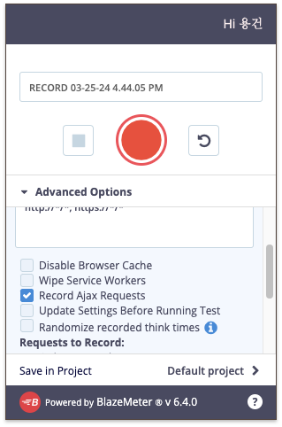

이후 가운데 빨간 녹화버튼을 클릭하여 시나리오를 녹화하신 후 정지버튼을 눌러 종료한다  

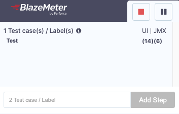

창을 다시 열면 Save 버튼이 생겨있습니다!

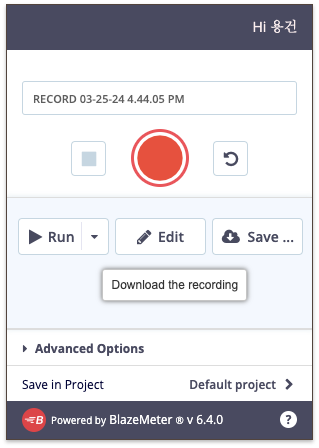

Save 버튼을 누르시면 확장자 선택 창이 열립니다

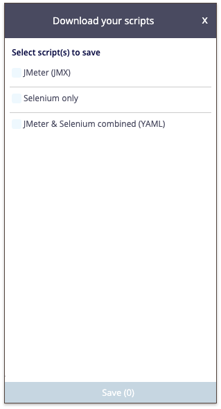

JMX확장자를 선택 후 다운로드 받고  
받으신 파일을 JMeter로 열게되면

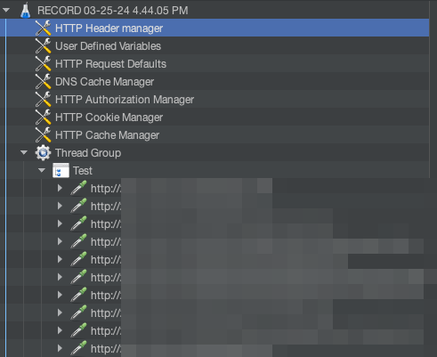

올바르게 동작한 시나리오가 녹화되어 적용되어 있습니다  
기본적인 Request와 설정 부분만 적용되어 있기 때문에 
[Listener](#결과값들을-테이블-형식의-데이터로-정리된-값으로-표시)들을
추가하여 사용하면 됩니다

